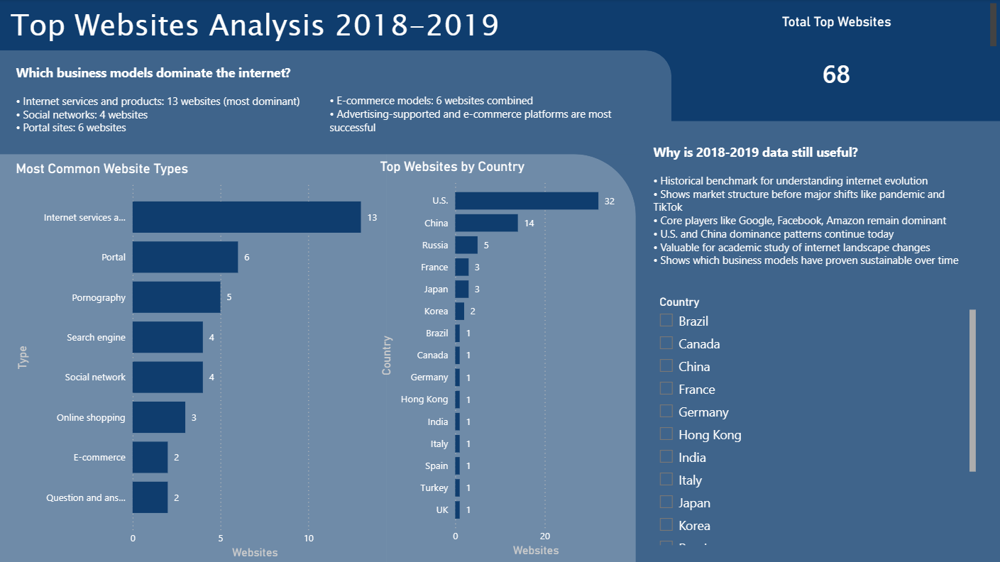

# Top Websites Analysis Dashboard

Power BI analysis of 69 top websites from 2018-2019 rankings, examining geographic distribution and website types.

## Repository Structure

```
website-data/
├── data/
│   └── top-websites.xlsx          # Raw dataset (69 websites)
├── powerbi/
│   ├── website_analysis.pbix      # Power BI dashboard
│   └── website_analysis.pbit      # Power BI template
├── analysis/
│   └── ANALYSIS.md                # Detailed findings
├── screenshots/
│   └── complete-dashboard.png     # Dashboard preview
└── README.md                      # This file
```

## Questions Answered

1. How many top websites are in the dataset?
2. Which countries dominate the top websites?
3. What types of websites are most common?
4. Why is this data from 2018-2019 still useful?
5. Which business models dominate the internet?
6. What types of websites appear most in the top rankings?
7. Which countries produce the most top-ranked websites?

## How to Use

1. **Open dashboard**: Load `powerbi/website_analysis.pbix` in Power BI Desktop
2. **View analysis**: Read detailed findings in `analysis/ANALYSIS.md`
3. **Use template**: Apply `website_analysis.pbit` to similar datasets

## Data Notes

- Raw data contains 69 websites with 1 duplicate (cleaned in Power BI)
- Data cleaning applied in Power BI: renamed columns, removed duplicate
- Final dashboard shows 68 unique websites

## Requirements

- Power BI Desktop

## Dashboard Preview


